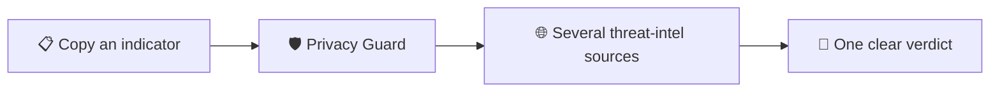

**🌐** [English](#-english) · [فارسی](#-فارسی) · [Русский](#-русский)

 

# 🔍 IOC Lens

### Copy it. Know in a second.
### کپی کن، در یک ثانیه بفهم.
### Скопируй. Узнай за секунду.

 

### ⬇️ [**Download from Releases · دانلود · Скачать**](https://github.com/mr-coder20/ioc-lens/releases)

<!-- Add a 10-second demo GIF: docs/assets/demo.gif, then uncomment:

-->

---

## 🇬🇧 English

**IOC Lens** is a lightweight, privacy-first desktop tool for SOC analysts and defenders. Copy an IP, domain, URL or file hash, and get one clear, explainable verdict from several threat-intelligence sources at once, without juggling browser tabs.

### ✨ Highlights
- ⚡ **Instant**: check what you just copied in a second
- 🌐 **Many sources, one answer**: results from several free threat-intel services, combined and explained
- 🛡️ **Privacy-first**: internal indicators stay on your machine; no account, no telemetry, your keys stay local
- 🪶 **Light and native**: small, fast, runs on **Windows, macOS and Linux**
- 🔓 **Open source** (MIT)

> IOC Lens is under active development. Features and capabilities will grow and change over time.

### 📥 Install
1. Open the **[Releases page](https://github.com/mr-coder20/ioc-lens/releases)**.
2. Under **Assets** of the latest release, download the file for your system:
   **Windows** → `.msi` · **macOS** → `.dmg` · **Linux** → `.deb`
3. Install it:
   - **Windows**: run the installer. If SmartScreen warns you, choose *More info → Run anyway*.
   - **macOS**: drag the app to *Applications*. On first launch, right-click it and choose *Open*.
   - **Linux**: `sudo apt install ./<downloaded-file>.deb`
4. 🔐 *Optional but recommended:* compare your file's SHA-256 with `SHA256SUMS.txt` from the same release.

### 🚀 Get started
1. Open **Settings → Providers** and add a free API key for at least one source.
2. Copy any indicator (IP, domain, URL, hash).
3. Use the shortcut shown in Settings, or click the tray icon. You get your verdict.

**Verdicts:** 🟢 Clean · 🟡 Low risk · 🟠 Suspicious · 🔴 Malicious · ⚪ No data (*not the same as safe*). Every verdict shows which sources contributed and why. It is a triage aid, not a final judgment.

---

## 🇮🇷 فارسی

**IOC Lens** یک ابزار سبک و حریم‌خصوصی‌محور برای تحلیلگران SOC و مدافعان امنیتی است. یک IP، دامنه، URL یا هش فایل را کپی کنید و بدون باز کردن چندین تب مرورگر، یک حکم واضح و قابل‌توضیح از چند منبع threat intelligence بگیرید.

### ✨ ویژگی‌های کلی
- ⚡ **فوری**: نتیجه‌ی آنچه تازه کپی کرده‌اید در چند ثانیه
- 🌐 **چند منبع، یک پاسخ**: ترکیب نتایج چند سرویس رایگان و توضیح شفاف آن
- 🛡️ **حریم خصوصی اول**: نشانگرهای داخلی روی دستگاه شما می‌مانند؛ بدون حساب کاربری، بدون تله‌متری، کلیدها فقط محلی
- 🪶 **سبک و بومی**: روی **ویندوز، مک و لینوکس**
- 🔓 **متن‌باز** (MIT)

> IOC Lens در حال توسعه‌ی فعال است. ویژگی‌ها و قابلیت‌ها با گذر زمان گسترش پیدا می‌کنند و ممکن است تغییر کنند.

### 📥 نصب
1. **[صفحه‌ی Releases](https://github.com/mr-coder20/ioc-lens/releases)** را باز کنید.
2. در بخش **Assets** آخرین نسخه، فایل مخصوص سیستم خود را دانلود کنید:
   **ویندوز** ← `.msi` · **مک** ← `.dmg` · **لینوکس** ← `.deb`
3. نصب کنید:
   - **ویندوز**: نصب‌کننده را اجرا کنید. اگر SmartScreen هشدار داد، *More info ← Run anyway* را بزنید.
   - **مک**: برنامه را به *Applications* بکشید. در اولین اجرا روی آن راست‌کلیک و *Open* را انتخاب کنید.
   - **لینوکس**: `sudo apt install ./<نام-فایل>.deb`
4. 🔐 *اختیاری ولی توصیه‌شده:* مقدار SHA-256 فایل را با `SHA256SUMS.txt` همان نسخه مقایسه کنید.

### 🚀 شروع کار
1. به **Settings ← Providers** بروید و برای حداقل یک منبع، کلید API رایگان وارد کنید.
2. هر نشانگری (IP، دامنه، URL، هش) را کپی کنید.
3. از میانبری که در Settings نوشته شده استفاده کنید یا روی آیکون tray کلیک کنید. حکم را می‌بینید.

**حکم‌ها:** 🟢 Clean · 🟡 Low risk · 🟠 Suspicious · 🔴 Malicious · ⚪ No data (*معادل امن بودن نیست*). هر حکم نشان می‌دهد کدام منابع و چرا در آن نقش داشته‌اند. این ابزار کمک تریاژ است، نه قضاوت نهایی.

---

## 🇷🇺 Русский

**IOC Lens** — лёгкое десктопное приложение для аналитиков SOC и защитников, где приватность на первом месте. Скопируйте IP, домен, URL или хеш файла и получите один понятный, объяснимый вердикт сразу от нескольких источников threat intelligence, не открывая кучу вкладок.

### ✨ Главное
- ⚡ **Мгновенно**: проверка только что скопированного за секунду
- 🌐 **Много источников, один ответ**: результаты нескольких бесплатных сервисов, объединённые и объяснённые
- 🛡️ **Приватность прежде всего**: внутренние индикаторы остаются на вашем компьютере; без аккаунта и телеметрии, ключи хранятся локально
- 🪶 **Лёгкое и нативное**: работает на **Windows, macOS и Linux**
- 🔓 **Открытый исходный код** (MIT)

> IOC Lens активно развивается. Функции и возможности будут расширяться и меняться со временем.

### 📥 Установка
1. Откройте **[страницу Releases](https://github.com/mr-coder20/ioc-lens/releases)**.
2. В разделе **Assets** последнего релиза скачайте файл для вашей системы:
   **Windows** → `.msi` · **macOS** → `.dmg` · **Linux** → `.deb`
3. Установите:
   - **Windows**: запустите установщик. Если SmartScreen предупредит, выберите *Подробнее → Выполнить в любом случае*.
   - **macOS**: перетащите приложение в *Программы*. При первом запуске щёлкните правой кнопкой и выберите *Открыть*.
   - **Linux**: `sudo apt install ./<скачанный-файл>.deb`
4. 🔐 *Необязательно, но рекомендуется:* сверьте SHA-256 файла с `SHA256SUMS.txt` из того же релиза.

### 🚀 Быстрый старт
1. Откройте **Settings → Providers** и добавьте бесплатный API-ключ хотя бы для одного источника.
2. Скопируйте любой индикатор (IP, домен, URL, хеш).
3. Используйте сочетание клавиш из Settings или нажмите на значок в трее. Вы получите вердикт.

**Вердикты:** 🟢 Clean · 🟡 Low risk · 🟠 Suspicious · 🔴 Malicious · ⚪ No data (*не значит «безопасно»*). Каждый вердикт показывает, какие источники и почему повлияли на результат. Это помощник для триажа, а не окончательное суждение.

---

### ⭐ Star · ستاره بده · Поставь звезду
**If IOC Lens saves you time, a star helps other defenders find it.**
اگر IOC Lens وقتتان را گرفته، یک ستاره به پیدا شدنش کمک می‌کند.
Если IOC Lens экономит ваше время, звезда поможет другим его найти.

[Contributing · مشارکت · Участие](CONTRIBUTING.md) · [Security · امنیت · Безопасность](SECURITY.md) · [Roadmap](docs/ROADMAP.md) · [MIT License](LICENSE)

